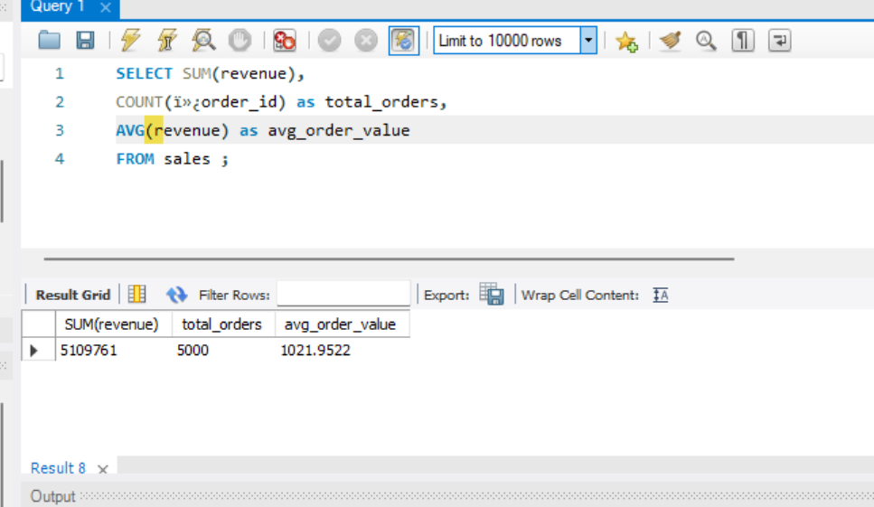
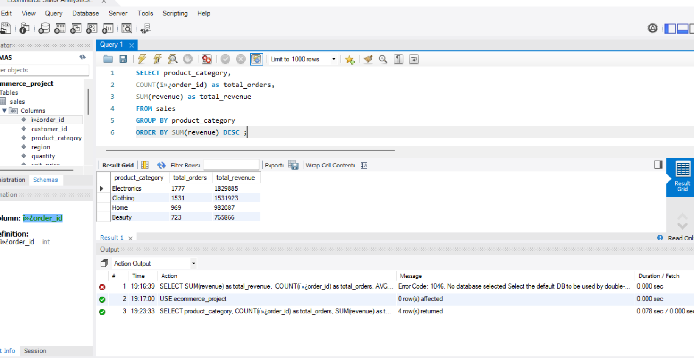
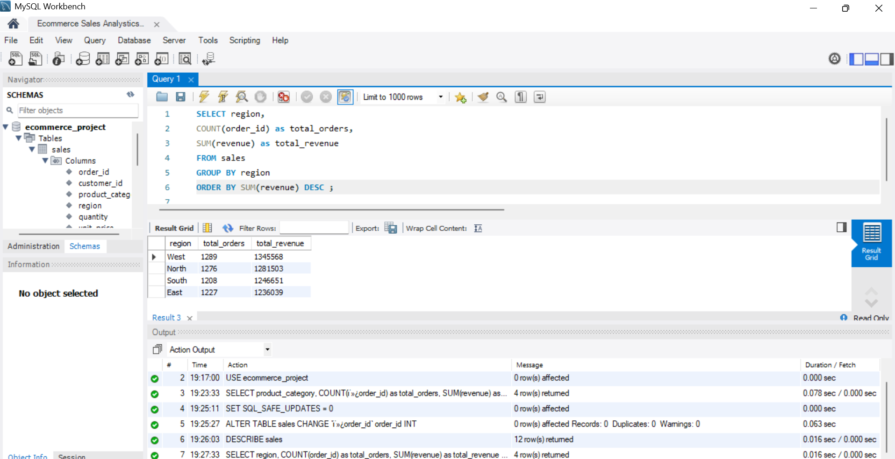
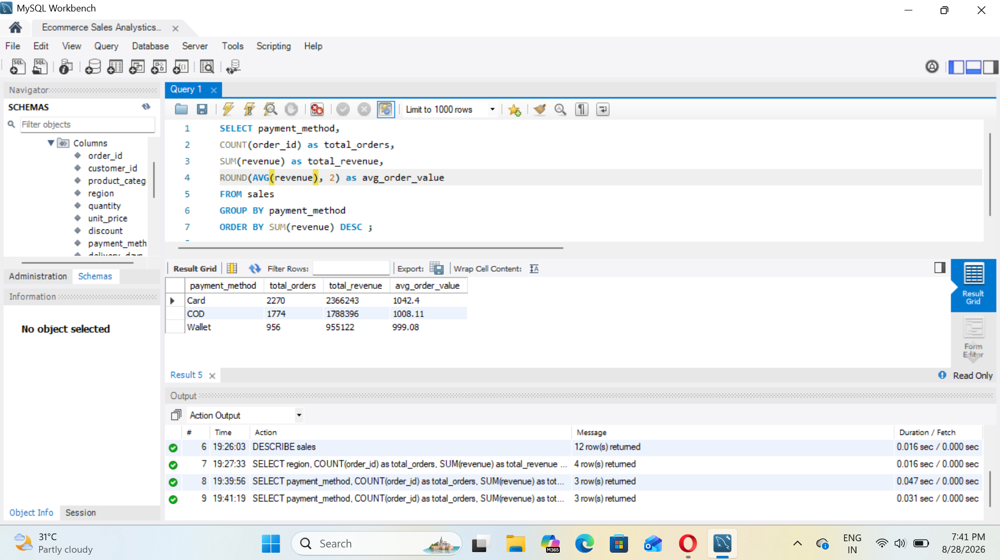
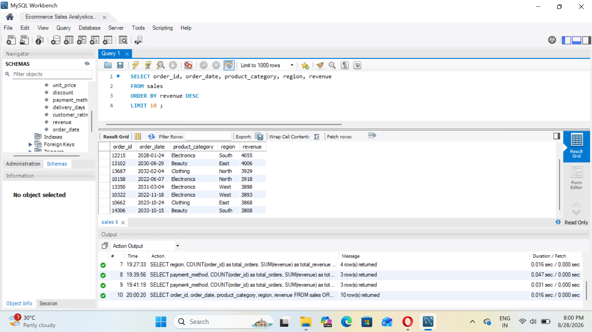
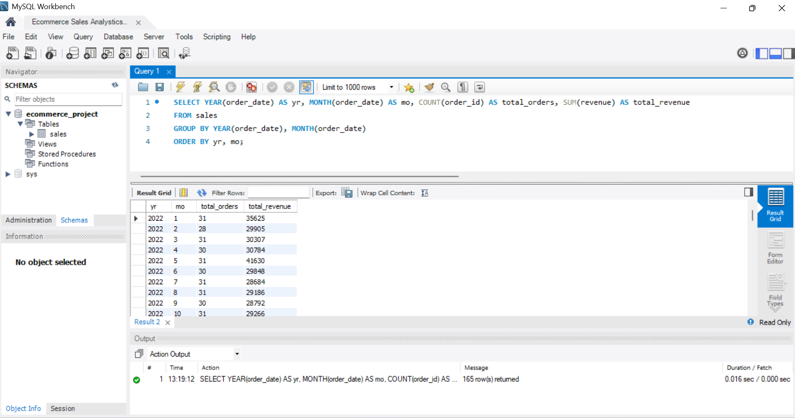
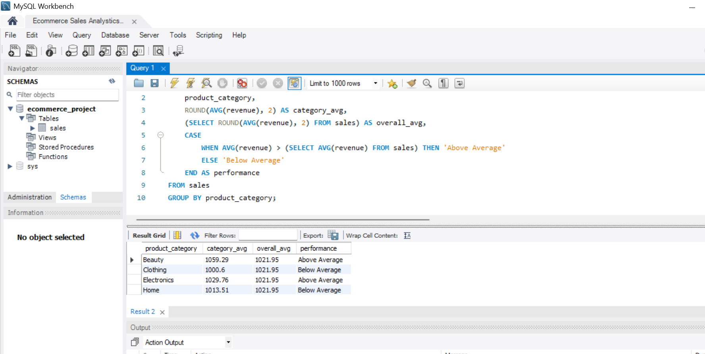
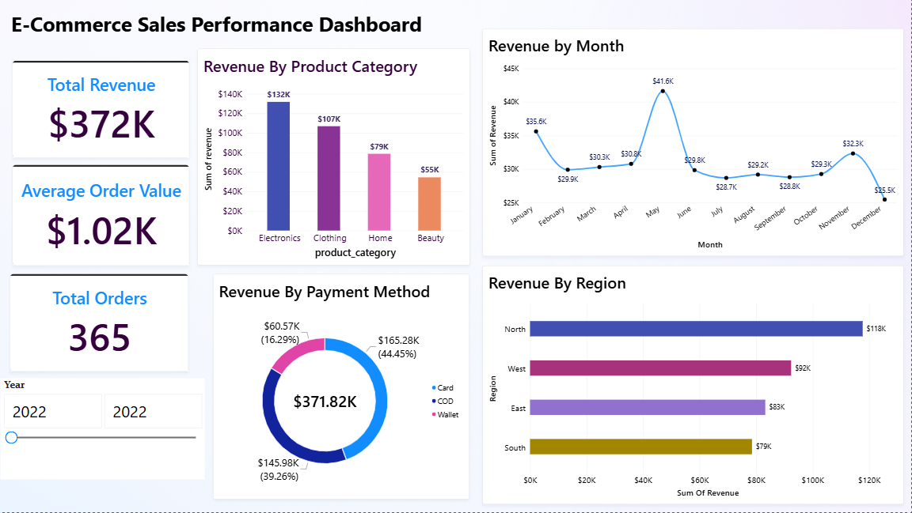

# ecommerce-sales-analysis
Sales performance analysis using Excel, MySQL, Power BI

## Key Insights
- Electronics drives the most revenue ($1.83M) of any category, 
  ahead of Clothing, Home, and Beauty.
- Beauty has the highest average order value ($1,059) despite the 
  lowest total revenue — it underperforms on customer reach, not 
  spend per order.
- Card payments generate the most revenue ($2.37M, 46% of total) and 
  the highest average order value of the three payment methods.
- Revenue is fairly evenly spread across regions overall (West leads 
  narrowly), but this shifts year to year — North led specifically 
  in 2022.
- May 2022 saw a sharp, unexplained revenue spike worth further 
  investigation.

## Problem Statement
Which product categories, regions, and payment methods drive the most 
revenue for this e-commerce business, and how does performance trend 
over time?

## Dataset
5,000 orders from a Kaggle e-commerce dataset — order date, customer, 
product category, region, quantity, price, discount, payment method, 
delivery time, customer rating, and revenue.
Source: Kaggle - E-Commerce Sales Performance Analysis

## Tools Used
- Excel — initial data organization
- MySQL (Workbench) — data cleaning and SQL analysis 
- Power BI — dashboard visualization 

## Process

### Stage 1: Excel
Organized and formatted the raw dataset's columns before importing 
into MySQL for deeper analysis.

### Stage 2: MySQL / SQL

Imported the dataset into MySQL and fixed data quality issues found 
during import:
- `order_date` was imported as text and converted to a proper DATE 
  column using `STR_TO_DATE()`.
- `revenue` contained currency symbols ($) and thousands-separator 
  commas, cleaned with `REPLACE()` before converting to DOUBLE.
- A hidden encoding artifact (BOM character) on `order_id` was 
  removed with `ALTER TABLE ... CHANGE`.

Wrote SQL queries covering aggregation, GROUP BY, sorting/limiting, 
date functions, a subquery, and a CASE statement.

**Key Findings:**
- Total revenue: **$5,109,761** across 5,000 orders (AOV: $1,021.95).
- **Electronics drives the most total revenue** ($1,829,885 from 1,777 
  orders), well ahead of Clothing, Home, and Beauty.
- Revenue is **evenly spread across regions** (West leads at $1.35M, 
  but all four regions are within ~8% of each other) — region isn't 
  a performance lever here, category is.
- **Card payments generate the most revenue** ($2,366,243) and the 
  highest average order value of the three payment methods.
- **6 of the top 10 highest-value single orders are Electronics or 
  Beauty**, reinforcing that these categories drive the biggest 
  individual sales, not just the highest volume.
- Comparing each category's average order value to the overall 
  average (via a subquery + CASE label) revealed a twist: **Beauty 
  has the highest average order value** ($1,059.29 vs $1,021.95 
  overall) despite having the *lowest* total revenue — it 
  underperforms on customer reach, not on what each customer spends.

  
  
  
  
  
  
  
  
  
### Stage 3: Power BI

Connected Power BI Desktop directly to the MySQL database and built an 
interactive dashboard with 3 KPI cards, 4 charts, and a Year slicer.

**Visuals included:**
- KPI cards: Total Revenue, Total Orders, Average Order Value
- Revenue by Product Category (bar chart)
- Revenue by Region (bar chart)
- Revenue by Payment Method (donut chart)
- Monthly Revenue Trend (line chart), filterable by Year

**Additional Insight (Power BI-specific):**
- Filtering the dashboard to 2022 specifically reveals that **May 2022 
  had a sharp revenue spike** (~$41.6K vs a ~$28-30K baseline in 
  surrounding months) — a pattern not obvious when scrolling through 
  raw SQL results across all 165 months at once.
- Regional performance is **not stable year-over-year**: North led 
  revenue in 2022 specifically, while West leads when looking at the 
  full multi-year dataset — a reminder that top-line totals can hide 
  which segment is actually driving results in any given period.

See `Sales_Performance_Dashboard.pbix` and `dashboard_2022_view.png` 
in this repo.

